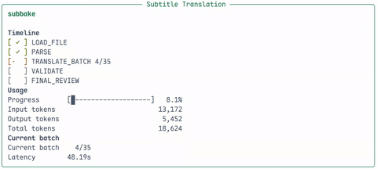

# subbake

[](https://pypi.org/project/subbake/)
[](https://pypi.org/project/subbake/)
[](https://github.com/heyifan142857/SubBake/actions/workflows/ci.yml)
[](LICENSE)

`subbake` 是一个简单的字幕翻译 CLI，默认将字幕翻译为中文，也可以通过 `--target-language en` 这类参数切到其他常用语言。

它的目标是用尽量直接的命令行工作流处理字幕翻译，同时保留对批量翻译、断点续跑、缓存和复审这些实用能力的支持。



## 核心能力

- 支持 `.srt`、`.vtt` 和按行处理的 `.txt`
- 默认翻译目标语言为中文，也支持 `en`、`ja`、`ko`、`fr`、`es`、`de` 等常用目标语言
- 智能批量翻译与上下文记忆，默认批次大小上限为 `30`
- 提供 `--fast` 快速模式，优先提高吞吐并尽量跑完
- 支持 `subbake.toml` 配置文件和多 profile 模型配置
- glossary 持久化、缓存复用、增量式断点续跑
- 输出校验、失败重试、失败样本落盘
- 针对高风险 batch 的最终复审，统一术语、语气和风格
- 基于 `rich` 的命令行可视化，包括进度、时间线和 Token 用量

## 安装

```bash
pip install subbake
```

本地开发可使用：

```bash
pip install -e .
```

或：

```bash
uv sync
```

## 快速开始

最常见的用法如下：

```bash
sbake translate input.srt --provider openai --model your-model
```

使用 OpenAI 兼容接口时，可通过环境变量配置：

```bash
export OPENAI_API_KEY="your_api_key"
export OPENAI_BASE_URL="https://your-provider.example.com/v1"
```

Anthropic 使用：

```bash
export ANTHROPIC_API_KEY="your_api_key"
sbake translate input.srt --provider anthropic --model your-model
```

内置 `mock` 后端可用于本地联调：

```bash
sbake translate input.srt --provider mock
```

翻译到其他目标语言时，可直接使用常见缩写：

```bash
sbake translate input.srt --provider openai --model your-model --target-language en
sbake translate input.srt --provider openai --model your-model --target-language ja
```

如果你不想每次都重复写 provider、model、语言和运行参数，可以参考仓库里的示例配置 [examples/subbake.toml](examples/subbake.toml)。

个人使用更推荐放在 home 全局配置里，这样平时直接 `sbake translate ...` 就够了；如果某个项目需要单独的 provider、model 或语言设置，再在项目目录里放一个 `subbake.toml` 覆盖即可。

然后直接运行：

```bash
sbake translate input.srt
sbake translate input.srt --profile fast_en
```

## 常用命令

翻译字幕：

```bash
sbake translate input.srt --provider openai --model your-model
```

输出双语字幕：

```bash
sbake translate input.vtt --provider openai --model your-model --bilingual
```

快速模式，优先提高速度和完成率：

```bash
sbake translate input.srt --provider openai --model your-model --fast
```

仅检查切分结果，不调用模型：

```bash
sbake translate input.txt --dry-run --batch-size 30
```

指定 glossary 文件：

```bash
sbake translate input.srt --provider openai --model your-model --glossary-path ./glossary.json
```

跳过已有状态，从头重新执行：

```bash
sbake translate input.srt --provider openai --model your-model --no-resume --no-cache
```

指定配置文件：

```bash
sbake translate input.srt --config ./subbake.toml
sbake check-key --config ./subbake.toml --profile chatgpt
```

指定输出路径：

```bash
sbake translate input.srt --provider openai --model your-model --output ./out/movie.zh.srt
```

转换输出格式：

```bash
sbake translate input.srt --provider openai --model your-model --output-format txt
sbake translate input.srt --provider openai --model your-model --output ./out/movie.en.txt
```

清理运行期文件：

```bash
sbake clean input.srt
sbake clean . --all
```

检查 Key 是否可用：

```bash
sbake check-key --provider openai
sbake check-key --provider anthropic
```

## 模型接入

支持以下后端：

- `mock`
- `openai`
- `anthropic`

其中 `openai` 后端也可用于 OpenAI 兼容接口。API Key 既可以通过环境变量提供，也可以通过 `--api-key` 直接传入；兼容接口地址可通过 `OPENAI_BASE_URL` 或 `--base-url` 指定。

## 运行期文件

默认情况下，工具会在输入文件同级目录下创建 `.subbake/` 目录，包含：

- `cache/`：按 prompt hash 缓存的模型响应
- `runs/.../run_state.json`：运行状态与断点续跑信息
- `runs/.../translated_batches/`：每个翻译 batch 的分片结果
- `runs/.../reviewed_batches/`：每个复审 batch 的分片结果
- `runs/.../failures/`：失败 batch 样本
- `glossary.<source>-to-<target>.json`：按语言对隔离的持久化 glossary
- `translation_memory.v2.<source>-to-<target>.<mode>.json`：按语言对和模式隔离的 translation memory，避免普通模式复用 fast 模式结果

可通过 `--work-dir` 指定运行目录，通过 `--glossary-path` 单独指定 glossary 文件位置。

## 配置文件

`sbake` 会按下面的顺序找配置：

- 命令行显式传入的 `--config`
- 当前目录向上查找的项目配置：`subbake.toml` 或 `.subbake.toml`
- home 全局配置
  - Linux / 通用：`~/.config/subbake/config.toml`
  - macOS：`~/Library/Application Support/subbake/config.toml`
  - Windows：`%APPDATA%\\subbake\\config.toml`
  - 兼容兜底：`~/.subbake.toml`

如果你只是自己长期使用一个模型配置，通常更适合把 [examples/subbake.toml](examples/subbake.toml) 复制到 home 全局配置位置；如果是仓库内协作，再把项目专用配置放在工作目录里。

参数优先级如下：

- 命令行显式传入的参数
- `--profile` 选中的 profile
- 配置文件里的 `[defaults]`
- 程序内置默认值

如果配置文件中有多个 profile，`sbake` 不会默认取第一个。你需要：

- 在配置文件里写 `default_profile = "name"`
- 或在命令行里显式传 `--profile name`

## 输出约定

- 普通输出：`input.translated.srt` / `input.translated.vtt` / `input.translated.txt`
- 双语输出：`input.bilingual.srt` / `input.bilingual.vtt` / `input.bilingual.txt`
- 可通过 `--output` 指定输出路径
- 可通过 `--output-format srt|vtt|txt` 强制指定输出格式
- 如果 `--output` 使用了受支持的后缀，例如 `result.txt`，`sbake` 会自动把它当成目标输出格式
- `srt` / `vtt` 可转为 `txt`，也可互转；`.txt` 输入不能转成 `srt` / `vtt`，因为原文件没有时间轴

## 常用参数

- `--provider`：模型提供方
- `--model`：模型名称
- `--api-key`：直接传入 API Key
- `--base-url`：OpenAI 兼容接口地址
- `--batch-size`：批次大小，默认 `30`
- `--fast`：快速模式，减少 prompt 上下文、跳过最终复审，并在结构不稳定时优先 best-effort 完成
- `--bilingual`：输出双语字幕
- `--source-language`：源语言提示，支持 `auto`、`en`、`ja`、`zh` 等常用缩写
- `--target-language`：目标语言，支持 `zh`、`en`、`ja`、`ko`、`fr`、`es`、`de` 等常用缩写
- `--config`：显式指定配置文件路径
- `--profile`：选择配置文件里的命名 profile
- `--dry-run`：只解析和切分 batch，不调用模型
- `--resume / --no-resume`：是否使用断点续跑
- `--cache / --no-cache`：是否启用缓存
- `--work-dir`：运行期目录
- `--glossary-path`：glossary 文件位置
- `--final-review / --no-final-review`：是否对高风险 batch 执行最终复审

完整命令说明请参考：

```bash
sbake translate --help
sbake check-key --help
sbake clean --help
```
